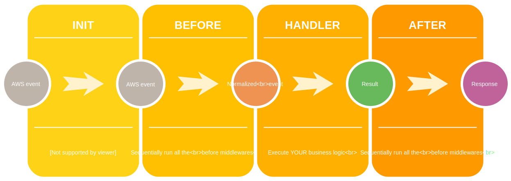

# AWS-MIDDLEWARE-JS

## CURRENTLY STILL A WORK IN PROGRESS

[](https://circleci.com/gh/ChocPanda/aws-middleware-js) [](https://codecov.io/gh/ChocPanda/aws-middleware-js) [](https://david-dm.org/ChocPanda/aws-middleware-js) [](https://github.com/ChocPanda/aws-middleware-js/blob/master/LICENSE) [](https://github.com/xojs/xo) [](http://commitizen.github.io/cz-cli/) [](https://github.com/semantic-release/semantic-release)

An opinionated Middleware and lifecycle framework for building service functions in AWS lambda functions.

## Inspiration

This project was inspired by [middy js](https://github.com/middyjs/middy), `a stylish library with some excellent tooling for building service functions`. The project has taken a few of those ideas and attempts to apply a more [functional programming style](https://codeburst.io/functional-programming-in-javascript-e57e7e28c0e5) to their implementation.

## Contents

<!-- toc -->

- [AWS-MIDDLEWARE-JS](#aws-middleware-js)
  - [CURRENTLY STILL A WORK IN PROGRESS](#currently-still-a-work-in-progress)
  - [Inspiration](#inspiration)
  - [Contents](#contents)
  - [Usage](#usage)
    - [API](#api)
      - [Simple example using callbacks:](#simple-example-using-callbacks)
      - [Promises](#promises)
      - [Middlewares](#middlewares)
    - [Lifecycle additions:](#lifecycle-additions)
  - [Middleware](#middleware)
    - [Custom Middlewares](#custom-middlewares)
  - [AWS Middleware JS Lifecycle](#aws-middleware-js-lifecycle)
  - [Why](#why)
    - [Take advantage of Execution Context reuse to improve the performance of your function](#take-advantage-of-execution-context-reuse-to-improve-the-performance-of-your-function)
    - [Reduce boilerplate for writing lambda functions](#reduce-boilerplate-for-writing-lambda-functions)
  - [References](#references)
  - [Notes](#notes)
  - [Contributions](#contributions)
    - [Conventional Commits](#conventional-commits)

<!-- tocstop -->

## Usage

  [Coming soon...](https://github.com/ChocPanda/aws-middleware-js/issues/11)

### API

aws-middleware-js fits seemlessly into the [programming model](https://docs.aws.amazon.com/lambda/latest/dg/nodejs-prog-model-handler.html) for writing AWS lambdas

#### Simple example using callbacks:

```javascript
const lambda = require('aws-middleware-js')

function myHandler(event, context, callback) {   
  //... function code   
  callback(null, "some success message");
  // or 
  // callback("some error type"); 
}

exports.handler = lambda(myHandler)
```

#### Promises

You can also use promises directly

```javascript
const lambda = require('aws-middleware-js')

function myAsyncHandler(event, context, callback) {   
  //... function code   
  const promise = foo(); // Some asynchronously executed code
  return promise
    .then(resultOfFoo => process(resultOfFoo))
    .catch(err => {
      console.log('Naughty error', err)
      return { statusCode: 500, body: 'An error occurred during execution' };
    })
}

exports.handler = lambda(myAsyncHandler)
```

and use async/await syntax

```javascript
const lambda = require('aws-middleware-js')

async function myAsyncHandler(event, context, callback) {   
  //... function code   
  const foo = await bar(); // Some asynchronously executed code
  return someOperation(foo);
}

exports.handler = lambda(myAsyncHandler)
```

#### Middlewares

The value of using the middlewares is that they encapsulate a composable, configurable API for isolating and your wrapping business logic in common boiler plate that would otherwise be cluttering your code base.

```javascript
const lambda = require('aws-middleware-js');
const jsonBodyParser = require('aws-middleware-js/middlewares/json-body-parser');
const httpErrorHandler = require('aws-middleware-js/middlewares/http-error-handler');

async function myAsyncHandler(event, context, callback) {   
  // All of this commented boiler-plate is made unnecessary simply by adding the the jsonBodyParser middleware and error handling middleware
  // try {
  //   const body = headers['Content-Type'] === 'application/json')
  //     ? JSON.parse(event.body)
  //     : {}
  // } catch (error) {
  //   other error handling...
  //   return { statusCode: 422, body: 'Unprocessable entity, invalid json in request body' }
  // }

  const body = event.body;   // A javascript object from the deserialized json in the original event
  const foo = await bar();
  //... function code
  return someOperation(foo);
}

exports.handler = lambda(myAsyncHandler)
  .use(jsonBodyParser())
  .use(httpErrorHandler())
```

### Lifecycle additions:

Currently this is just adding an initialisation step to the lambda function, aws-middleware-js lazily evaluates the resource and caches the result for [reuse of the execution enviroment](https://docs.aws.amazon.com/lambda/latest/dg/best-practices.html).

The lazy evaluation makes mocking/stubbing shared resources much easier for unit testing with frameworks/libraries such as [jest](https://jestjs.io/docs/en/mock-functions#mocking-modules), [sinon](https://sinonjs.org/releases/v7.3.2/mocks/), [simple-mock](https://github.com/jupiter/simple-mock#mock), etc...

Caching allows users to make full use and reuse of the [lambda execution context](https://docs.aws.amazon.com/lambda/latest/dg/running-lambda-code.html)

```javascript
const lambda = require('aws-middleware-js');
const AWS = require('aws-sdk')

const myHandler = s3 => (event, context, callback) => {

  var params = { Bucket: process.env.BUCKET_NAME, Key: process.env.BUCKET_KEY, Body: process.env.BODY };
  
  // function code...
  s3.putObject(params, function(err, data) {
    if (err) {
      callback(err)
    } else {
      callback(null, 'Put the body into the bucket! YAY!')
    }
  });
  
}

exports.handler = lambda({ init: () => new AWS.S3(), handler: myAsyncHandler });
```

## Middleware

- [JSON Body Parser](./src/middlewares/json-body-parser/README.md)
- Content Negotiation - [Coming soon...](https://github.com/ChocPanda/aws-middleware-js/issues/15)
- Http Error Handling - [Coming soon...](https://github.com/ChocPanda/aws-middleware-js/issues/14)
- Http Query Parser - [Coming soon...](https://github.com/ChocPanda/aws-middleware-js/issues/13)
- [...Your idea here](https://github.com/ChocPanda/aws-middleware-js/issues/new)

### Custom Middlewares

Can't find quite what you're looking for? Why not [consider contributing...](./CONTRIBUTING.md), [raising a feature request](https://github.com/ChocPanda/aws-middleware-js/issues/new?assignees=&labels=&template=feature_request.md&title=) or upvoting an [existing one](https://github.com/ChocPanda/aws-middleware-js/issues) counts and is helpful in prioritisation, but if you're in a hurry here's how to create custom middleware.

The middlewares are all simple javascript objects with **atleast 1** of the following 3 functions:

- **before**: A function called before the handler, used to update/add to the lambda event or context
```javascript
/**
 * @param {AWSLambdaEvent} event aws event triggering the lambda
 * @param {AWSLambdaContext} context aws runtime/execution context
 * @returns {(Array|AWSLambdaEvent|undefined)}
 * 		- An array with 2 elements [newEvent {AWSLambdaEvent}, newContext {AWSLambdaContext}]
 * 		- A new AWSLambdaEvent
 * 		- {undefined} if the middleware had no changes to make to the event/context
 */
function before(event, context) { // ...function code
```
- **after**: A function called after the handler, used to update/add to the lambda response
```javascript
/**
 * @param {AWSLambdaResponse} result the result of having called the lambda function with the given event and context
 * @param {AWSLambdaEvent} event aws event that triggered the lambda
 * @param {AWSLambdaContext} context aws runtime/execution context
 * @returns {(Array|AWSLambdaResponse|undefined)}
 * 		- An array with 2 elements [newEvent {AWSLambdaResponse}, newContext {AWSLambdaContext}]
 * 		- A new AWSLambdaResponse
 * 		- {undefined} if the middleware had no changes to make to the event/context
 */
function after(result, event, context) { // ...function code
```
- **onError**: A function called in the event the handler or another middleware should throw an exception, used to create a response from the lambda
```javascript
/**
 * @param {AWSLambdaResponse} result the accumulated response of other error handling middlewares
 * @param {Error} error the error that was thrown either by a preceeding middleware or the lambda function
 * @param {AWSLambdaEvent} event aws event that triggered the lambda prior to the exception being thrown
 * @param {AWSLambdaContext} context aws runtime/execution context
 * @returns {(Array|AWSLambdaResponse|undefined)}
 * 		- An array with 2 elements [new result {AWSLambdaResponse}, new Error {Error}]
 * 		- A new result {AWSLambdaResponse}
 * 		- {undefined} if the middleware had no changes to make to the event/context
 */
function onError(result, error, event, context) { // ...function code
```

Documentation detailing the contents of:
- [AWSLambdaEvent](https://docs.aws.amazon.com/lambda/latest/dg/lambda-services.html) (Depends on the trigger)
  - e.g.: [API Gateway](https://docs.aws.amazon.com/apigateway/latest/developerguide/request-response-data-mappings.html#mapping-request-parameters)
- [AWSLambdaContext](https://docs.aws.amazon.com/lambda/latest/dg/nodejs-prog-model-context.html)
- AWSLambdaResponse (Depends on the trigger)
  - e.g.: [API Gateway](https://docs.aws.amazon.com/apigateway/latest/developerguide/request-response-data-mappings.html#mapping-response-parameters)
- Error
  - Currently all errors thrown by built in middlewares will be [http-errors](https://github.com/jshttp/http-errors). This is because API gateway is a common trigger for lambdas and the existing middlewares are most useful behind API Gateway. Please [report any non-http-errors](https://github.com/ChocPanda/aws-middleware-js/issues/new?assignees=&labels=&template=bug_report.md&title=) thrown by any built-in middlewares.

```javascript
const myCustomMiddleware = (middlewareConfig) => ({
  before: (event, context) => { /* function code... */ },
  after: (result, event, context) => { /* function code... */ },
  onError: (error, event, context) => { /* function code... */ }
});
```
Once created there is no special transformation or class, just... [use it as you would any other middleware](#api)

```javascript
const lambdaFunc = require('aws-middleware-js');

export.handler = lambdaFunc(handler).use(myCustomMiddleware(myMiddlewareConfig))
```

All of the middlewares function can be either synchronous or asynchronous, it's up to you and your use case.

## AWS Middleware JS Lifecycle

AWS Middleware JS provides a lifecycle for use when building service functions, the motivation for this was to make the lambdas more testable by removing side effects from the lambda files.



## Why

### Take advantage of Execution Context reuse to improve the performance of your function

  This is pretty simple to do and Amazon provide a number of examples of code that does exactly that where the coding samples will initialise global/static variables outside of the scope of handler function so that if the execution context is reused they are already initialised and the recycled environment is more performant than when the lambda function is executed from a cold start.

  The problem with these examples is that the shared resources are often initialised as a side effect of simply loading the javascript file into memory (fairly poor practice when writing modular code), it makes the service functions more difficult to test because it is difficult to mock or provide stub dependencies. This middleware library provides a lifecycle which supports enables mocking dependencies and encourages developers to write pure javascript files free from side effects.

### Reduce boilerplate for writing lambda functions

  When writing lambdas there can be a fair bit of boiler plate code wrapping up the business logic and cluttering your code base, AWS middleware abstracts this out into common reusable middlewares that can be configured and shared accross all your lambdas

## References

- [AWS Lambda functions](https://aws.amazon.com/lambda/)
- [Best Practices guide](https://docs.aws.amazon.com/lambda/latest/dg/best-practices.html#function-code).

## Notes

A key factor here is that the lambdaFunc will respect how you want to write AWS lambdas:
- if you want to return a promise, lambda-func will return a promise
- if you want to use callbacks, lambda-func call the callback

Always while wrapping up your code in the middlewares you've chosen with no extra work.

This library is designed and written to be as small and lightweight as possible ([a nano library if you will](https://medium.com/@kelin2025/writing-js-libraries-less-than-1tb-size-6342da0c006a)). Therefore I won't include any dependencies in here specific to just a single middleware however if it's useful I will try to create and maintain seperate intergrations with other libraries.

## Contributions

See our [contributing doc](./CONTRIBUTING.md), be sure to checkout the [code of conduct](./CONTRIBUTING.md#code-of-conduct)

### Conventional Commits

This project used [conventianal commits](https://www.conventionalcommits.org/en/v1.0.0-beta.3/#specification) to manage versions and releases of the library therefore when making a commit please use `yarn commit <COMMIT_PARAMETERS>` and this will guide you through writing a conventional commit message which can be understood work with the ci pipeline
